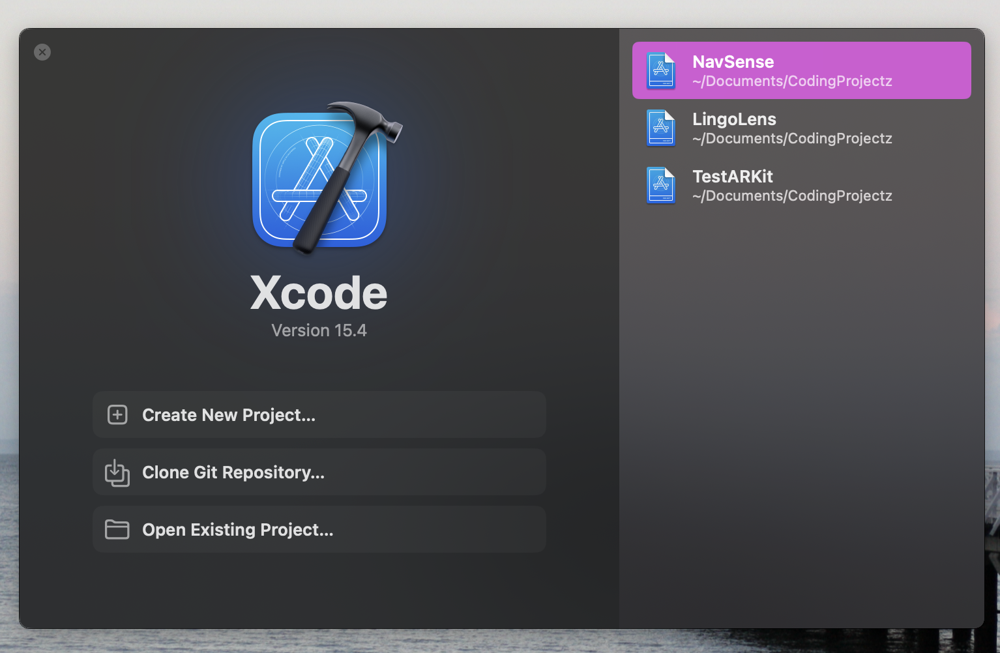
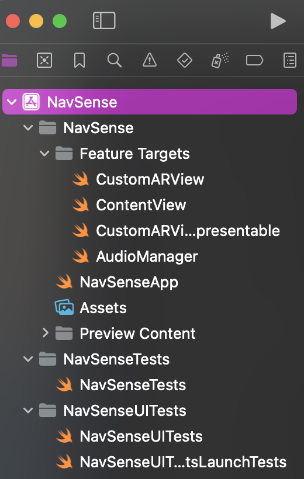
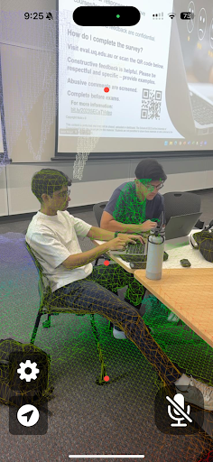

# BumpLess (DECO3801 Project)
BumpLess is a mobile application that helps you Bump Less!

## Authors
**BnY Innovators**
- Alvin Benny (Second Year Student of Computer Science and Cyber Security)
- Kit Man Marco Tam (Second Year Student of Computer Science and Commerce)
- Janvi Rattan Atre (Final Year Student of Computer Science)
- Chua Yi Xun (Final Year Student of Computer Science)
- Toh Weiheng Jerome (Second Year Student of Computer Science and Data Science)
- Arjun Srikanth (Final Year Student of Computer Science)

## Project Overview
Our solution, driven by the motto "Empowering vision at every corner" is to develop an app using swift that enhances the independence and safety of visually impaired individuals.
The app will scan the environment, accept user commands via buttons or voice, and project a path to help users navigate to specific locations or items using audio and haptic feedback.
This intuitive tool will provide real-time, non-visual guidance, allowing users to confidently and safely navigate their homes.

## Repository Overview
- `NavSense/Feature Targets/ContentView.swift`: Contains the SwiftUI-based UI for displaying the AR view and depth points on the screen.
- `NavSense/Feature Targets/CustomARView.swift`: ARKit-based custom view that processes scene depth data and sends audio feedback based on detected object distance.
- `NavSense/Feature Targets/AudioManager.swift`: Manages all audio feedback based on proximity, converting distance ranges into specific audio cues.
- `NavSense/Feature Targets/CustomARViewRepresentable.swift`: SwiftUI wrapper for the CustomARView class, integrating AR functionalities with the SwiftUI view hierarchy.
- `README.md`: Project documentation.

## Installation

1. **Clone the Repository**

Open a terminal and navigate to the directory where you want to store the project. Run the following command to clone the repository:

```bash
git clone https://github.com/MiNat015/NavSense.git
```

2. **Open Xcode**

Ensure that you have Xcode installed on your Mac. You can install Xcode via the Mac App Store if you don't already have it.

Open Xcode, and you should see the following screen:

<p align="center">

</p>

Click on '**Open Existing Repository**' and navigate to the directory where you cloned the repository.

3. **Navigate to Project Settings**

Open **Project Settings** (highlighted in purple) and go to **Signing and Capabilities**. Select a **Team** using the dropdown select and paste `com.BumpLess.deco` in the **Bundle Identifier** field.

<p align="center">

</p>

4. **Connect a Device**

Connect a supported iOS device (with a LiDAR sensor). Follow the setup prompts on both your computer and iOS device. To check the device's setup status, navigate to **Window > Devices and Simulators**. Your device name should appear in the left-hand navigation column.

5. **Build and Run the Project**

Once your device has been setup, make sure to select a valid target device from the toolbar. Press the Run button or use the shortcut `Cmd + R` to build and run the project.

6. **Grant Necessary Permissions**

Since BumpLess uses ARKit and provides audio feedback, the app will request permission to access the camera and microphone. Make sure to grant these permissions. You may also need to trust the developer to run the application. To do so, go to **Settings** on your iOS device, then **General > VPN and Device Management**, and trust the developer/team you selected earlier.

7. **Test the App**

You can now interact with the app through your iOS device.

## Using the Application
Once you've successfully installed and launched BumpLess on your iOS device, follow these steps to use the application:

1. **Hold the Device**: Hold your iOS device in portrait mode, with the camera facing forward as you would when taking a photo.

2. **Scan the Environment**: Slowly pan the device around your environment. The app will use the LiDAR sensor to scan and create a mesh of your surroundings.

<p align="center">

</p>

3. **Listen for Audio Feedback**: As you move the device, you'll hear different audio cues:
   - An audio message indicating an object is immediately ahead (within 0.5 meters).
   - An audio message indicating an object is one step ahead (within 1.5 meters).
   - An audio message indicating an object is two steps ahead (within 2.0 meters).
   - An audio message indicating the path is clear if there is no object within 2.0 meters.

4. **Feel Haptic Feedback**: In addition to audio cues, you'll feel vibrations that correspond to the proximity of detected objects. Stronger vibrations indicate closer objects.

5. **Navigate Safely**: Use the audio and haptic feedback to guide your movements. Move slowly and adjust your direction based on the feedback to avoid obstacles.

6. **Explore Different Environments**: Practice using the app in various settings, starting with familiar spaces before moving to new environments.

Remember, BumpLess is designed to assist with navigation, but it should not replace other mobility aids or techniques you may use. Always prioritize your safety and use the app in conjunction with your existing navigation skills and tools.

## Results
Our testing showed that BumpLess accurately detects objects at various distances and provides real-time feedback to users. The app improves mobility by using audio cues that correlate to the user’s distance from obstacles, helping them navigate through their environment safely and confidently.
